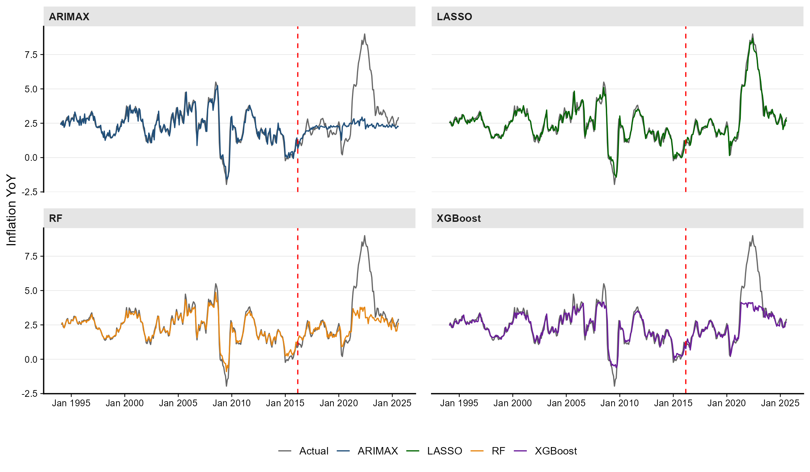

# US-infl-macro

Forecasting US CPI inflation (YoY, `CPIAUCSL_PC1`) from a monthly macro panel of 28
predictors, Jan 1994 – Sept 2025. Compares LASSO, Random Forest, XGBoost, ARIMAX and PCR
on a chronological 70/30 split, with SHAP-based interpretation.

Coursework for the Experimental Economics seminar.



## Layout

```
├── run_all.R                  entry point
├── data/
│   ├── raw/                   CPI, gold, BCOM — immutable inputs
│   ├── temp/                  half-built data, safe to delete
│   └── final/infl_macro.csv   model-ready panel
├── R/
│   ├── 00_config.R            paths and constants
│   ├── 01_prepare_data.R      FRED pull, transforms, ADF, differencing
│   ├── 02_benchmark_models.R  LASSO / RF / XGBoost x {no lag, AR1} + ARIMAX
│   ├── 03_xgboost_shap.R      XGBoost, feature importance, SHAP
│   ├── 04_final_figures.R     paper figures, LASSO coefficients, PCR
│   └── 05_model_grid.R        2x2 actual vs predicted panel
└── output/                    figures, tables, models, logs (all regenerated)
```

## Running it

```bash
Rscript run_all.R
```

A subset, when you only want to redraw the grid:

```bash
Rscript run_all.R 5
```

From the R console, `source("run_all.R")` runs everything; set `STAGES <- 2:5` first for
part of it.

| # | Script | Writes |
|---|--------|--------|
| 1 | `01_prepare_data.R` | `data/final/infl_macro.csv` |
| 2 | `02_benchmark_models.R` | `output/tables/results.xlsx` |
| 3 | `03_xgboost_shap.R` | XGBoost figures, `table_variable_summary_XGB.xlsx` |
| 4 | `04_final_figures.R` | paper figures, `table_variable_summary_LASSO.xlsx` |
| 5 | `05_model_grid.R` | `output/figures/final/model_grid.*` |

Stage 1 needs an internet connection (`quantmod::getSymbols`). Stages 2–5 read only
`data/final/infl_macro.csv`, so they run offline.

`run_all.R` checks its inputs first, runs each stage in its own environment, times them,
stops at the first failure, and writes a transcript plus `sessionInfo()` to
`output/logs/`. It exits non-zero on failure.

Each stage gets a private environment for two reasons: the scripts open with
`rm(list = ls())`, which would otherwise wipe the runner's own variables, and isolation
catches any stage that only works because of state left behind by the previous one.

## Results

Out-of-sample RMSE on the test window (Apr 2016 – Sept 2025, 114 obs):

| Model | RMSE | MAE | sMAPE |
|---|---|---|---|
| LASSO (AR1) | 0.295 | 0.210 | 0.094 |
| XGBoost (AR1) | 1.526 | 0.804 | 0.207 |
| Random Forest (AR1) | 1.772 | 0.981 | 0.271 |
| ARIMAX | 2.171 | 1.352 | 0.406 |

Full table, including the no-lag specifications and in-sample RMSE, in
`output/tables/results.xlsx`.

## Known issues

Open methodological problems, kept here so they are not forgotten:

- **All regressors are contemporaneous.** `inflation_t` is regressed on `X_t`, so nothing
  here is a forecast, and `CUUR0000SEHA` (CPI rent) is a component of the target.
- **No naive benchmark.** A no-change forecast scores RMSE 0.392 on this test window, so
  RF, XGBoost and ARIMAX are all worse than assuming inflation does not move. Only LASSO
  beats it, and mostly through `inflation_lag1`.
- **XGBoost early-stops on the test set** (`watchlist = list(val = valMatrix)`), so its
  reported test RMSE is optimistic.
- **Tree models cannot extrapolate.** 17 of 114 test observations exceed the training
  maximum (9.0 vs 5.5), so RF and XGBoost structurally cannot reproduce the 2021–22 surge.
- **Script 03's performance table is hand-typed**, so it will drift from `results.xlsx`.
- `watchlist` is deprecated in current xgboost and will become an error; rename to `evals`.

## Data and version control

`data/raw/` and `data/final/` are committed; `output/` and `data/temp/` are not.

This is deliberate. Stage 1 pulls 28 series live from FRED and never saves the untouched
download, and FRED revises its published history — so `data/final/infl_macro.csv` is the
only record of the panel as of a given pull date. Re-running stage 1 later produces
different numbers. Until stage 1 caches its raw pull, that file is the reproducibility
anchor.

`output/` is excluded because `run_all.R` rebuilds it and binary figures do not diff. The
one exception is `model_grid.png`, force-added so this README renders. To pin a full set
of figures for a submission:

```bash
git add -f output/tables/results.xlsx output/figures/final
```

## Next steps

- `renv::init()` and commit `renv.lock` before writing a Dockerfile.
- Dockerfile on `rocker/r-ver:4.5.2`, restore from `renv.lock`, `CMD ["Rscript", "run_all.R"]`.
- Cache the raw FRED pull to `data/raw/` so the panel becomes genuinely reproducible.
